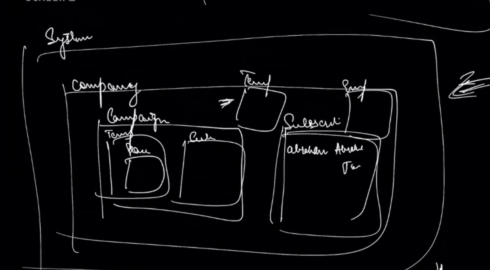
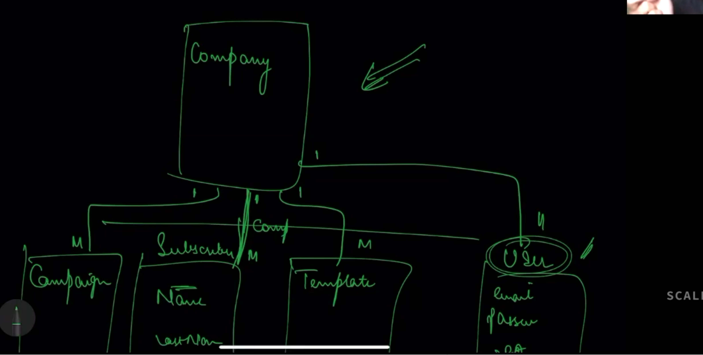

# Email campaign management system

## Overview

- Recruiter gives pool of candidates, and has a ladder of emails
- If a user doesn't reply to 1st email for x days, the second email gets triggered and so on
- Basically we need to manage campaigns 

## Requrements

- Templates would be strings with placeholder for some fields
- A campaign can have any number of templates
- Admin of a Campaign can see the templates and manage them
- RBAC, anyone who is part of the company can create campaigns
- Only the employees of the company can see the campaign
- Each template will have a offset(days)
- campaign will have start date and end date
- Ability to stop the campaign
- We can modify an already running campaign

## Notes

- We can have a email sending strategy for use cases where we pause the campaign and then resume. We need to see what to do with old emails. Should we send all in one shot etc? this can be handled with email sending strategy design pattern

