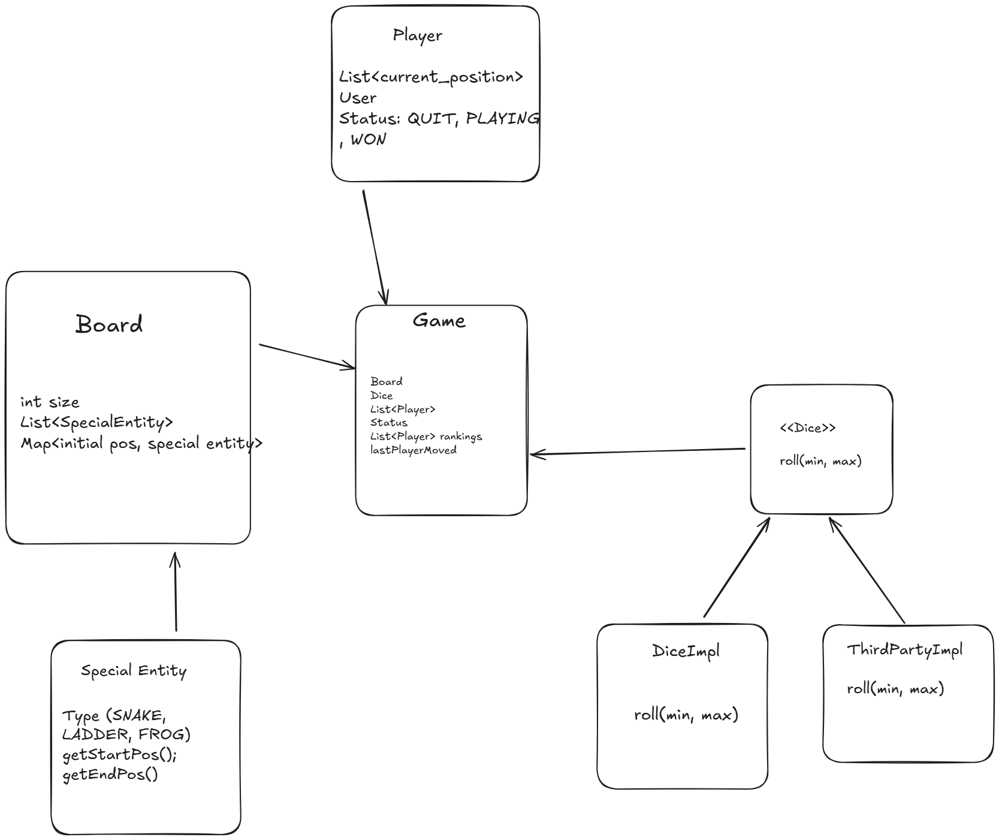

# Snakes and Ladder

## Requirements

- Number of players that can play are infinite
- size of board can be even greater than 100
- one dice only and assume dice is a third party entity
- Any number of snakes and ladders but the game must be solvable
- game automatically decides the position of snakes and ladder
- How does a game start?
- When will a game end?

## Features of the game

- Game will be played with multiple Human players
- Every player uses a 3p dice and dice can return any number
- Board can be of any size
- There can be different types of special characters eg snake, ladder, frog etc... in future
- The position of special feature is decided randomly
- The conbination of different feature should be valid
- Next move can be decided based upon one of the  multiple ways that exist
    - When the game start for a player
    - When the game end for a player

## Class diagram

